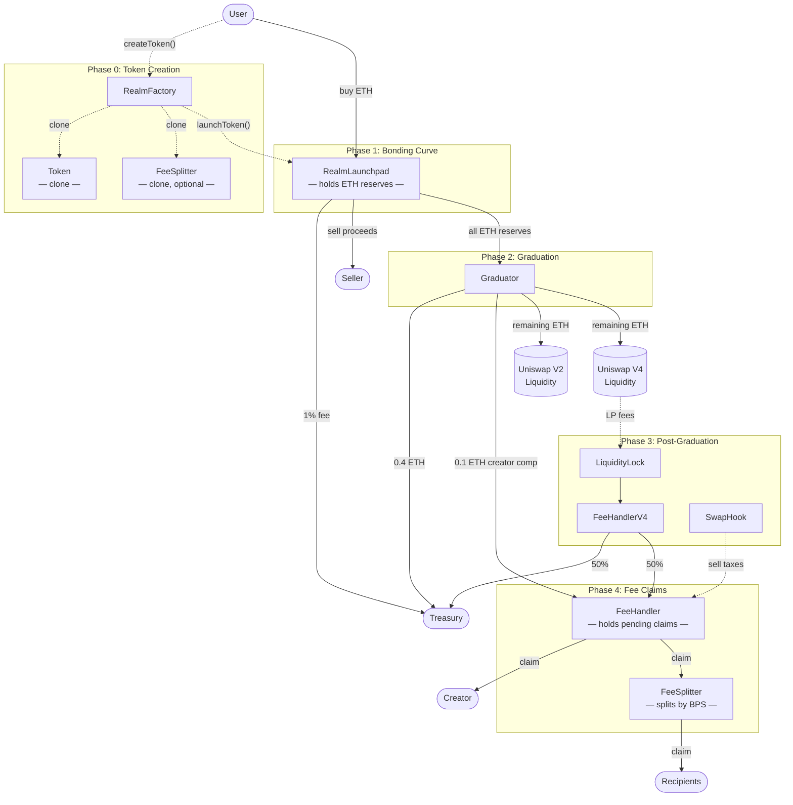

# Realm Protocol — ETH Flow

```mermaid
flowchart TD
    User([User])

    subgraph phase0["Phase 0: Token Creation"]
        Factory[RealmFactory]
        Token[Token<br/>— clone —]
        FeeSplitter0[FeeSplitter<br/>— clone, optional —]
    end

    subgraph phase1["Phase 1: Bonding Curve"]
        Launchpad[RealmLaunchpad<br/>— holds ETH reserves —]
    end

    subgraph phase2["Phase 2: Graduation"]
        Graduator[Graduator]
    end

    subgraph phase3["Phase 3: Post-Graduation"]
        LiqLock[LiquidityLock]
        FeeHandlerV4[FeeHandlerV4]
        SwapHook[SwapHook]
    end

    subgraph phase4["Phase 4: Fee Claims"]
        FeeHandler[FeeHandler<br/>— holds pending claims —]
        FeeSplitter[FeeSplitter<br/>— splits by BPS —]
    end

    UniV2[(Uniswap V2<br/>Liquidity)]
    UniV4[(Uniswap V4<br/>Liquidity)]
    Treasury([Treasury])
    Creator([Creator])
    Seller([Seller])
    Recipients([Recipients])

    %% Phase 0 — Token creation (no ETH)
    User -. "createToken()" .-> Factory
    Factory -. "clone" .-> Token
    Factory -. "clone" .-> FeeSplitter0
    Factory -. "launchToken()" .-> Launchpad

    %% Phase 1
    User -- "buy ETH" --> Launchpad
    Launchpad -- "1% fee" --> Treasury
    Launchpad -- "sell proceeds" --> Seller

    %% Phase 2
    Launchpad -- "all ETH reserves" --> Graduator
    Graduator -- "0.4 ETH" --> Treasury
    Graduator -- "0.1 ETH creator comp" --> FeeHandler
    Graduator -- "remaining ETH" --> UniV2
    Graduator -- "remaining ETH" --> UniV4

    %% Phase 3 (V4)
    UniV4 -. "LP fees" .-> LiqLock
    LiqLock --> FeeHandlerV4
    FeeHandlerV4 -- "50%" --> Treasury
    FeeHandlerV4 -- "50%" --> FeeHandler
    SwapHook -. "sell taxes" .-> FeeHandler

    %% Phase 4
    FeeHandler -- "claim" --> Creator
    FeeHandler -- "claim" --> FeeSplitter
    FeeSplitter -- "claim" --> Recipients
```
