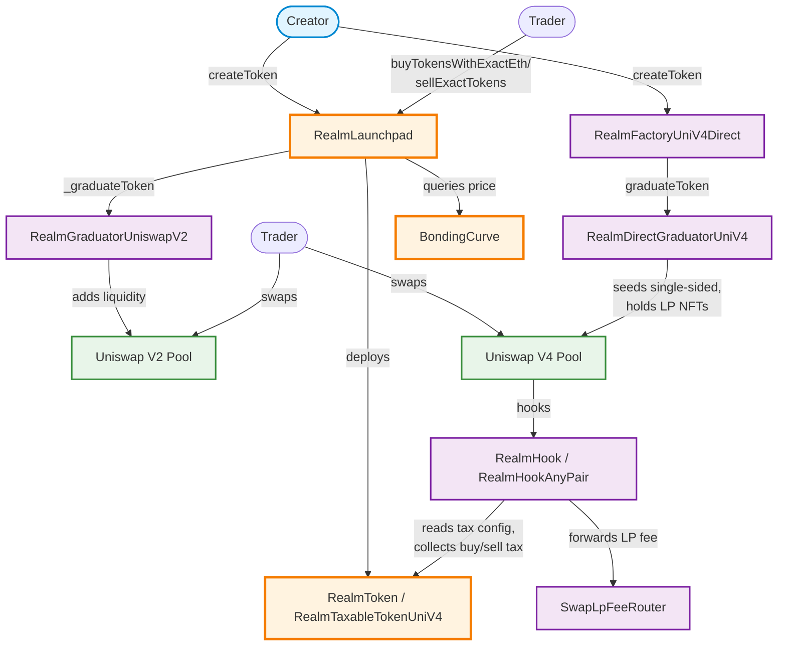

# Realm Protocol Architecture

## System Overview

This diagram shows the main contracts and fund flows in the Realm protocol, including token creation, trading, and graduation to DEX liquidity.

## Key Fund Flows

### 1. Token Creation
- **Creator** calls `createToken()` on **RealmLaunchpad**
- Launchpad deploys a **RealmToken** or **RealmTaxableTokenUniV2**
- Assigns a **ConstantProductBondingCurve** for pricing

### 2. Pre-Graduation Trading
- **Trader** calls `buyTokensWithExactEth()` to purchase tokens
  - ETH sent to launchpad reserves
  - Trading fee taken to treasury
  - Bonding curve calculates token amount
- **Trader** calls `sellExactTokens()` to sell tokens
  - Tokens burned from circulation
  - ETH returned from reserves (minus fee)

### 3. Graduation (Triggered Automatically)
When ETH reserves reach graduation threshold:

#### V2 Graduation Path
- Launchpad calls `graduateToken()` on **RealmGraduatorUniswapV2**
- Creates **Uniswap V2 Pool** via `initialize()`
- Adds liquidity and locks LP tokens at dead address

#### Direct V4 launch (no curve)
V4 tokens never touch the launchpad or a bonding curve:
- **Creator** calls `createToken()` on **RealmFactoryUniV4Direct**
- **RealmDirectGraduatorUniV4** creates 1-3 **Uniswap V4 Pools** at creator-chosen prices (native pools on **RealmHook**, ERC20-quoted pools on **RealmHookAnyPair**), seeds the supply as single-sided token bands and executes the optional dev buy, all in the creation tx
- The token is graduated from birth; the graduator holds the position NFTs forever (the liquidity lock). No graduation fee
- The hook reads each token's fees via `getSwapFees()` and forwards the LP fee and any tax on every swap

### 4. Post-Graduation Fee Collection (V4 only)
- The hook forwards the LP fee to **SwapLpFeeRouter**, which splits it 70/30 between the creator (via `RealmMasterFeeHandler`) and the protocol treasury
- Creators claim their share from `RealmMasterFeeHandler`
