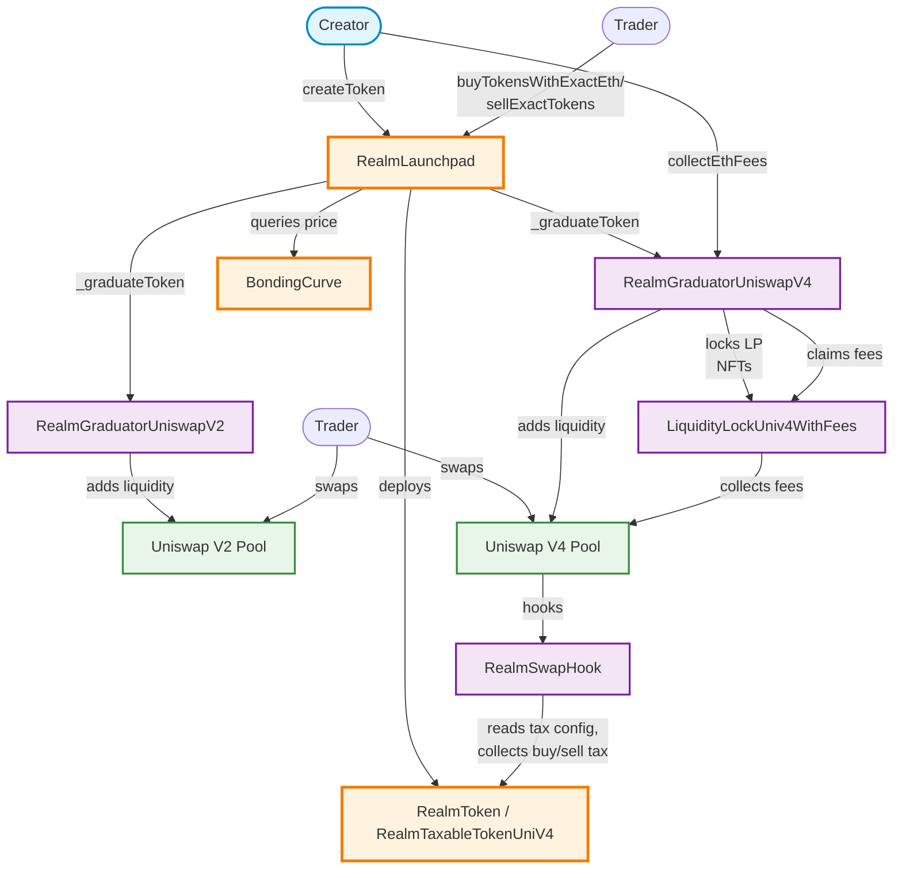

# Realm Protocol Architecture

## System Overview

This diagram shows the main contracts and fund flows in the Realm protocol, including token creation, trading, and graduation to DEX liquidity.

## Key Fund Flows

### 1. Token Creation
- **Creator** calls `createToken()` on **RealmLaunchpad**
- Launchpad deploys a **RealmToken** or **RealmTaxableTokenUniV4**
- Assigns a **ConstantProductBondingCurve** for pricing

### 2. Pre-Graduation Trading
- **Trader** calls `buyTokensWithExactEth()` to purchase tokens
  - ETH sent to launchpad reserves
  - Trading fee taken to treasury
  - Bonding curve calculates token amount
- **Trader** calls `sellExactTokens()` to sell tokens
  - Tokens burned from circulation
  - ETH returned from reserves (minus fee)

### 3. Graduation (Triggered Automatically)
When ETH reserves reach graduation threshold:

#### V2 Graduation Path
- Launchpad calls `graduateToken()` on **RealmGraduatorUniswapV2**
- Creates **Uniswap V2 Pool** via `initialize()`
- Adds liquidity and locks LP tokens at dead address

#### V4 Graduation Path
- Launchpad calls `graduateToken()` on **RealmGraduatorUniswapV4**
- Creates **Uniswap V4 Pool** via `initialize()`
- Adds two liquidity positions (balanced + single-sided ETH)
- Locks LP NFTs in **LiquidityLockUniv4WithFees**
- **RealmSwapHook** reads each token's `TaxConfig` (`buyTaxBps`, `sellTaxBps`, `taxDurationSeconds`) and collects the configured buy/sell tax on every V4 swap while `block.timestamp <= graduationTimestamp + taxDurationSeconds`. The hook itself does not enforce any duration cap; the cap is enforced at creation by the factory (`MAX_TAX_DURATION_SECONDS = 365 days` for the default path, up to `MAX_CHARITY_TAX_DURATION_SECONDS = 120 years` in charity mode — a single non-deployer fee receiver and ownership renounced at creation; the charity address is NOT verified on-chain) and the resulting window is immutable on the token.

### 4. Post-Graduation Fee Collection (V4 only)
- **Creator** calls `collectEthFees()` on graduator
- Graduator claims fees from locked LP positions
- Splits 50/50 between creator and protocol treasury