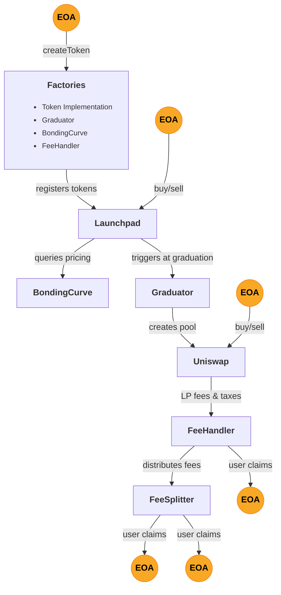

# Realm Modules

```mermaid
graph TD
    EOA0(("<b>EOA</b>")) -->|createToken| Factory["<b>Factories</b>
    <small><ul style='text-align: left;'><li>Token Implementation</li><li>Graduator</li><li>BondingCurve</li><li>FeeHandler</li></ul></small>"] -->|registers tokens| Launchpad["<b>Launchpad</b>"]

    EOA4(("<b>EOA</b>")) -->|buy/sell| Launchpad
    Launchpad -->|queries pricing| BondingCurve["<b>BondingCurve</b>"]
    Launchpad -->|triggers at graduation| Graduator["<b>Graduator</b>"]

    Graduator -->|creates pool| Uniswap["<b>Uniswap</b>"]
    EOA5(("<b>EOA</b>")) -->|buy/sell| Uniswap
    Uniswap -->|LP fees & taxes| FeeHandler["<b>FeeHandler</b>"]

    FeeHandler -->|distributes fees| FeeSplitter["<b>FeeSplitter</b>"]
    FeeHandler -->|user claims| EOA1(("<b>EOA</b>"))

    FeeSplitter -->|user claims| EOA2(("<b>EOA</b>"))
    FeeSplitter -->|user claims| EOA3(("<b>EOA</b>"))

    style EOA0 fill:#f9a825,stroke:#f57f17,color:#000
    style EOA1 fill:#f9a825,stroke:#f57f17,color:#000
    style EOA2 fill:#f9a825,stroke:#f57f17,color:#000
    style EOA3 fill:#f9a825,stroke:#f57f17,color:#000
    style EOA4 fill:#f9a825,stroke:#f57f17,color:#000
    style EOA5 fill:#f9a825,stroke:#f57f17,color:#000
```
